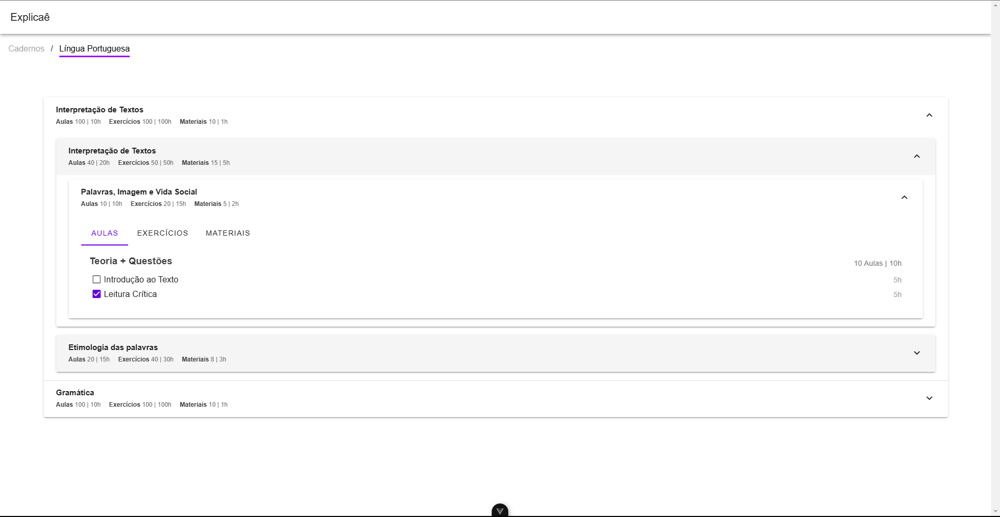

# Accordion Explicaê Challenge

Este repositório contém a solução para o desafio proposto pela empresa explicaê. Nele você pode acessar os cadernos relativos a uma matéria.

<div align="center">
    
</div>

## Tecnologias utilizadas
Busquei acelerar a criação da interface e focar na lógica de exibição dos dados por isso escolhi as ferramentas:

- Vue 3 (Requisito)
- Tailwind 4
- Vuetify 3
- Vuex 4 (Requisito)
- Eslint
- TypeScript
- Vite
- Prettier

## Como instalar o projeto na sua máquina
Certifique-se de ter o node instalado em sua máquina
```bash
# Clone o repositório
git clone https://github.com/adriel-mp3/accordion-challenge.git

# Acesse o diretório do projeto
cd accordion-challenge

# Instale as dependências
npm install

# Inicie o servidor de desenvolvimento
npm run dev
```

## Setup recomendado (IDE)

[VSCode](https://code.visualstudio.com/) + [Volar](https://marketplace.visualstudio.com/items?itemName=Vue.volar) (desabilite o Vetur).

## Considerações Finais
Durante o desenvolvimento do desafio, priorizei a entrega ágil e eficiente, optando pelo Vuetify e Tailwind para facilitar a composição da interface e obter resultados rapidamente. Antes de começar a codificar, me dediquei a entender a estrutura da tela e o propósito de cada componente, o que me permitiu planejar melhor a componentização e a organização do código.

A parte de mockar os dados foi um pouco trabalhosa, mas mantive o foco na implementação da solução principal. Ainda há diversos pontos que podem ser aprimorados, mas meu objetivo foi entregar um código claro, organizado e de fácil compreensão, destacando meu raciocínio e abordagem para resolver o problema. 🚀